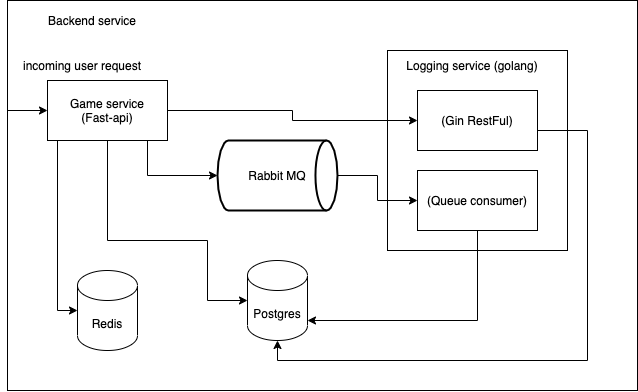

## Table of contents
* [General info](#general-info)
* [Technologies](#technologies)
* [System architecture](#system-architecture)
* [Setup](#setup)
* [URL](#url-terminal)


## General info
This project is backend card matching game. Default a cardboard is size 4*3
contains 6 pairs of number from 1 to 6. This provides api to get best score of personal and global user.
	
## Technologies
Project is created with:
* Fast api
* Postgrest SQL
* Rabbit MQ
* Golang
* APM
* Redis
	
## System architecture




## Setup
To run this project, install it locally using docker-compose:

```
$ cd ../project-name
$ docker-compose up -d
```

## url terminal
* http://localhost:8000/docs (API terminal)
* http://localhost:5601/app/apm (APM)
* http://localhost:15673 (Rabbit MQ management guest:guest)
